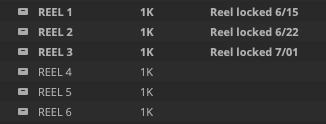

# binlock
`binlock` will create an Avid bin lock (`.lck`) file with custom text.  This can be used to programatically create a bin lock for a given Avid user, or to "permanently" lock an Avid bin while displaying a custom message.



## Usage
### Basic Usage
`binlock` is intended to be run via the command line:
```bash
$ python3 binlock.py CustomText /output/path.lck
```
...where `CustomText` is the text you would like displayed, and `/output/path.lck` is the filename of the lock you would like to create.

### Fancy Usage

`binlock` will always ensure the file extension is `.lck`, no matter what is specified in the output path.  Because of this, a more intuitive way to use `binlock` is to provide the path to the Avid bin (`.avb`) itself -- by simply dragging it into the terminal window -- and an accompanying `.lck` file will be created with the same name as the bin.  For example:

```bash
$ python3 binlock.py "Do Not Touch" /Volumes/AvidProject/Bins/ImportantBin.avb
```
...will create a lock file at `/Volumes/AvidProject/Bins/ImportantBin.lck` and the bin will be immediately seen as locked in Avid.

By default, `binlock` will never overwrite an existing lock.

## Secrets
### What's *Really* Goin' On Here

Avid's bin lock file isn't anything wild.  It's simply a `UTF-16le`-encoded text file, padded out to 255 characters.  But... you know... I mean... I don't know.  Maybe the script is a little bit quicker than setting up your text editor for a less-common character encoding.
